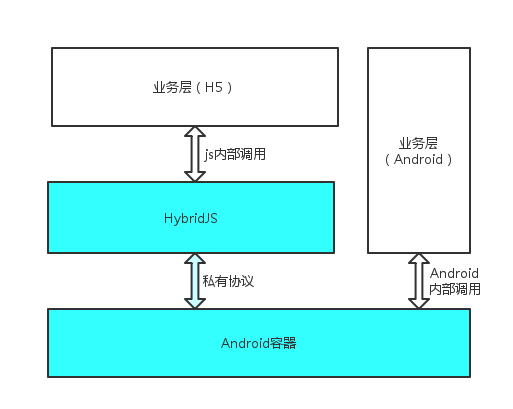
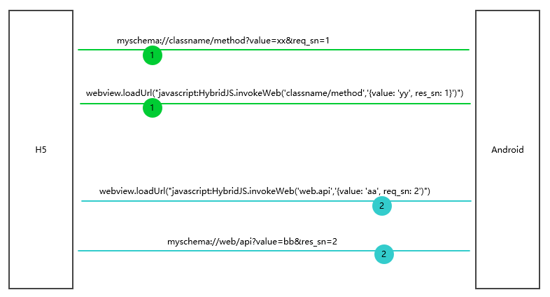

### 通讯基础

- Android调用H5

``` java
webview.loadUrl("javascript: alert('hello world')");
```

通过Webview类的`loadUrl`方法可以直接执行js代码，从而达到Android调用H5

- H5调用Android

理论上，通过Android的[shouldOverrideUrlLoading](https://developer.android.com/reference/android/webkit/WebViewClient.html#shouldOverrideUrlLoading(android.webkit.WebView, android.webkit.WebResourceRequest))接口，Webview是可以拦截一切H5发起的请求的，无论是标准协议（如`http://`、`https://`等）还是私有协议（如`myschema://`）。

基于这个原理，H5采用私有协议模拟发起URL请求，Android解析这类URL并定制相应的响应值，这就实现了H5调用Android。


采用私有协议有几个好处：

1. 简化Android逻辑复杂度（混淆使用标准协议需要Android拦截到URL的时候做过滤）
2. 为APP外部打开APP内部界面提供接口（如“浏览器页面内启动原生APP界面”这类需求就是基于这个原理实现的）


### 通讯的实现（即JSBridge）

上面说的只是理论基础，如果每次互相调用都去查询对方给出的api和参数，随着时间的推移会带来一定的维护成本，所以需要封装Android层和H5业务层之间互相调用的细节，抹平Android各平台和JS的调用差异，对H5业务层提供一致性的调用接口。

本项目中JSBridge的实现即`HybridJS`对象（目前只兼容到Android平台）。

整个架构如下：




#### 互相调用


##### H5调用Android

方法：

``` js
HybridJS.invokeApp(api, params)
```

这是H5调用Android的入口，H5调用Android提供的API和Web回调Android的调用这两种情况都属于H5调用Android。最终解析完成会向Android发起一个私有协议的请求，格式如下：

``` js
schema://classname/method?value={} // Android会收到这个url
```

`schema`即自行约定的私有协议，一般是公司名或者应用名

`classname/method`这两个一起，指定API名称，classname可以是Android的类名，当然也可以只是一个普通字符串（如namespace），只要Android方便识别即可

`value`是与method对应的参数

请求示例：

``` js
// H5直接指定包名和方法名，这样更容易扩展
iframe.src = `myschema://com.mycompany.hybrid.InteractHandler/toast?value={msg: 'hello world'}`

// 用约定的字符串也可以，Android拿到之后自己再做一次map
iframe.src = `myschema://interact/toast?value={msg: 'hello world'}`
```

##### Android调用H5

方法：

``` java
webview.loadUrl("javascript:HybridJS.invokeWeb(api[, ...args]])")
```

`HybridJS.invokeWeb`是Android调用JS的入口，Android回调H5或者Android调用H5接口都属于这种情况。

Android调用H5接口的需求很少，但也不排除存在性。


#### 异步接口的实现

因为JS是单线程，在设计与非接口的时候都尽可能采用异步的方式。

上面的例子是简单的SET类，不需要返回值。对于需要Android返回值给H5的接口，需要做一些额外的事情。

由于同时存在H5调用Android然后Android再回调H5和Android调用H5然后H5再返回值给Android的情况，所以这里将发起请求的一方叫调用方，另一方叫被调方。

为了区分多次不同的调用，在调用方发起请求时会带上一个特殊的标记——sn，这样保证回调的顺序不乱。

同时由于调用方调用被调用方和调用方回调被调用方在代码层面都是同一个接口（例如H5调用Android API和Web回调Android的调用这两种情况都是调用`HybridJS.invokeApp`方法），为了区分本次调用是api调用还是回调调用，sn需要做区分，本项目的做法是请求方带过去的key名叫`req_sn`，回调带过去的叫`res_sn`

调用示例:




#### 事件（push）

我们知道，H5只能拿到页面软键盘的一系列事件，需要获取硬件事件的需求也不是没有，比如国产魅族手机的mback键，经常有碰到产品经理奇（bian）怪（tai）的需求，让H5拦截mback键做一些逻辑。Android能捕获这一事件，所以理所应当的可能传递给H5，从而实现H5的mback事件。

在笔者看来，事件其实和push很相似，都是一方主动向另一方推送一些数据，而自己不需要知道对方是否接收以及处理结果。

所以，本项目中事件和API调用是分开的（代码实现也有不一样）。

Android向H5推送事件：

``` java
webview.loadUrl("javascript:HybridJS.notifyWeb(eventname[, data])")
```

如上述，Android通过`HybridJS.notifyWeb`接口向H5推送事件，第一个参数是事件名，理论上事件可以是Android真实的事件，也可以是自定义事件，第二个参数是事件对应的对象。

这其实就是push了！

不过，如果事件是键盘事件或其他交互事件，每次都传递给H5看起来似乎没有必要，在Web世界中事件都遵循监听则处理不监听则不处理的原则，所以这里对于交互事件，还需要一个监听的操作，即H5事先告诉Android需要监听某个事件，当事件真正发生时Android才会传递给H5。

H5监听事件格式：

``` js
HybridJS.on(eventname, handler)
```

内部则会发起下面的URL请求：

``` js
// Android收到的URL
myschema://com.mycompany.hybrid.event.somevent/listen
```

有监听必有取消监听：

``` js
// Android收到的URL：myschema://com.mycompany.hybrid.event.somevent/cancelListen
HybridJS.off(eventname[, handler])
```


### UA约定

为了便于H5的调试，Android容器统一在webview的UA里边追加一些标识：

- 增加“HybridAPP”标识，有此标志的会认为H5运行在app里边，否则是浏览器环境

- 增加app名称和版本，用于区分是哪个app，例如音乐盒子，增加“MusicBox/1”标识

示例：
``` java
// java code
String ua = webview.getSettings().getUserAgentString();

ua += " HybridAPP MusicBox/1";

webview.getSettings().setUserAgentString(ua);
```
